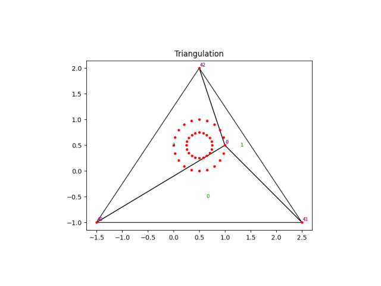

# Constrained Delaunay Triangulation

A simple Python implementation of constrained Delaunay triangulation for educational purposes and experimentation.



## Overview

This project implements Delaunay triangulation using Sloan's algorithm with robust geometric predicates for numerical stability. The implementation prioritizes clarity and educational value over performance, making it ideal for learning about computational geometry concepts.

## Features

- **Delaunay Triangulation**: Complete implementation using Sloan's incremental algorithm
- **Robust Predicates**: Integration of Shewchuk's exact arithmetic predicates for:
  - `orient2d`: Orientation test for three points
  - `incircle`: Point-in-circle test for four points
- **Minimal Dependencies**: Lightweight design with only essential Python packages
- **Educational Focus**: Clean, readable code with extensive comments and documentation

## Status

- ✅ **Delaunay Triangulation**: Fully implemented and tested
- 🚧 **Constrained Triangulation**: Work in progress

The constrained Delaunay triangulation functionality (handling of fixed edges and boundaries) is currently under development. The basic Delaunay triangulation is complete and functional.

## Installation

Clone the repository and install dependencies:

```bash
git clone <repository-url>
cd pycdt
uv sync
```

Or with pip:

```bash
pip install -e .
```

## Quick Start

```python
from src.delaunay import triangulate
import numpy as np

# Generate random points
points = np.random.rand(50, 2) * 100

# Create triangulation
t = triangulate(points)

# Visualize (if matplotlib is installed)
t.plot(exclude_super_t=True)
```

## Algorithm Details

### Sloan's Algorithm

The implementation follows Sloan's incremental algorithm for Delaunay triangulation:

1. Sort points lexicographically
2. Create initial bounding triangle
3. Insert points one by one, maintaining Delaunay property
4. Use local optimization (edge flipping) to restore Delaunay condition

### Robust Predicates

To handle numerical precision issues common in computational geometry, this implementation uses Shewchuk's robust geometric predicates:

- **orient2d**: Determines the orientation of three points (clockwise, counterclockwise, or collinear)
- **incircle**: Tests whether a point lies inside, outside, or on the circumcircle of a triangle

These predicates use adaptive precision arithmetic to provide exact results even for nearly degenerate cases.

## Project Structure

```
├── src/
│   ├── delaunay/
│   │   ├── __init__.py
│   │   └── delaunay.py
├── tests/
│   └── test_cdt.py
├── examples/
│   └── circles.py
├── assets/
│   └── triangulation.gif
├── pyproject.toml
└── README.md
└── uv.lock
```

## Examples

See the `examples/` directory for more detailed usage examples:

- `circles.py`: Creating animations and plots of the triangulation process

## Development

This project uses modern Python tooling:

```bash
# Install development dependencies
uv sync --dev

# Run tests
pytest

# Format code
black .
ruff check --fix .

# Type checking
mypy src/
```

## References

- Sloan, S.W. (1987). "A fast algorithm for constructing Delaunay triangulations in the plane"
- Shewchuk, J.R. (1997). "Adaptive Precision Floating-Point Arithmetic and Fast Robust Geometric Predicates"
- de Berg, M., et al. (2008). "Computational Geometry: Algorithms and Applications"

## Contributing

This is primarily an educational project, but contributions are welcome! Please:

1. Fork the repository
2. Create a feature branch
3. Add tests for new functionality
4. Ensure all tests pass and code is properly formatted
5. Submit a pull request

## License

MIT License - see LICENSE file for details.

## Acknowledgments

- Jonathan Shewchuk for the robust geometric predicates
- S.W. Sloan for the incremental triangulation algorithm
- The computational geometry community for excellent resources and references
